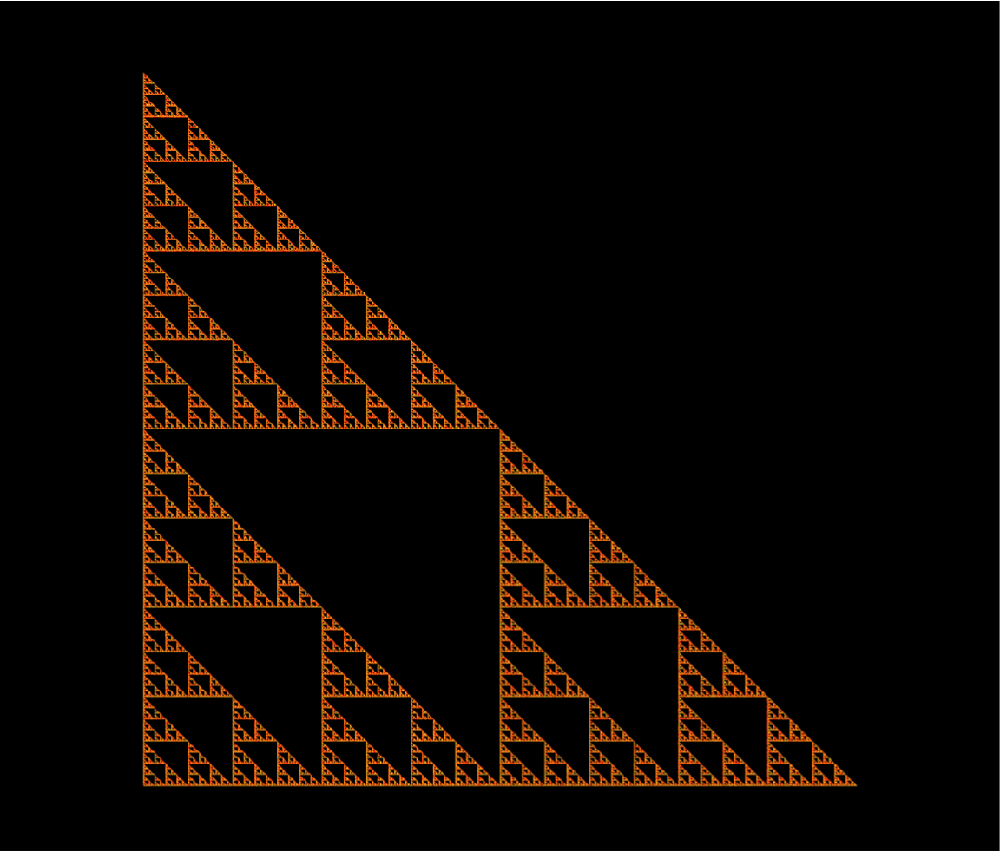

# Final Project: [Chaos Game Web Application](https://fractal-generator.herokuapp.com/) (and more) Max Brodeur & Theo Fabi
## 1. Overview of our Project

Built using Python, HTML and CSS, our web application includes many fractal generating functionalities. First and foremost, fractals such as the sierpinski triangle and the viscek square can be drawn using the chaos game feature. The user can choose the initial polygon, specify the compression ratio of each iteration, and incorporate extra rules to form a variety of attractors. The user can also select from a list of attractor presets which load the appropriate parameters for the attractor. Additionally, the application incorporates the more general concept of iterated function systems (IFSs), with which even more complex fractals can be constructed, wherein the user specifies a list of possible transformation parameters and their relative weights. Presets for the dragon curve, the barnsley fern and other such shapes can be loaded and drawn.
Additionally, the application incorporates a feature which automatically finds 2D chaotic discrete maps. The details of this functionality will be discussed in detail in Section 3.

The website can be accessed [here](https://fractal-generator.herokuapp.com/).
## 2. Brief Overview of Iterated Function Systems & Chaos Game
An Iterated Function System (IFS) is a fonite set of contractive functions which are applied iteratively on an initial point ad infinitum. At every iteration, one transformation among the set is chosen at random and applied to the previous point, yielding the next input for the next iteration. Often, these systems form self-similar fractals, as an arbitrary point at an arbitrary iteration is subject to the same conditions as any other point. In general, it is required that these transformations be contractive, otherwise solutions may be unbounded. However, the general requirement is that the entire system must be contractive on average.
The chaos game is an example of an IFS. In brief, the classical version of the process consists of choosing a random point within an equilateral triangle and repeatedly applying the following procedure:
1. Randomly choose one of the vertices of the triangle
2. Jump half-way from the previous point to the chosen vertex
3. Repeat with the newly drawn point
The game can formally be defined as an IFS with the following three choices of transformations: 
* (xn+1,yn+1)=(0.5xn,0.5yn)
* (xn+1, yn+1) = (0.5xn + 0.5, 0.5yn)
* (xn+1, yn+1) = (0.5xn, 0.5yn + 0.5)
which, after a suficient number of iterations and with initial conditions within the triangle, yields the sierpinski right triangle. Although the transformations are chosen at random, the system consistently forms the same fractal attractor.
#### Figure 1: The sierpinski right triangle drawn with our website

Other fractals can be constructed using this method. As mentioned in the 1rst section, both the chaos game IFS abstraction and general IFS system fractal generation features are incoporated in the website. Also of note is the fact that both the fractal above and below can be generated using pre-loaded presets in our web application, along with many others.

#### Figure 2: The "IFS Dragon" generated with our website

## 3. Automatic Generation of Discrete Chaotic Attractors
1D discrete maps can exhibit chaotic behaviour if their lyapunov exponent is positive. Similarly, 2D discrete maps, which have two lyapunov exponents (one for each dimension), exhibit chaotic behaviour if one of their lyapunov exponents is positive.
Our website includes a feature which automatically finds quadratic and cubic chaotic 2D maps. When plotted, these systems often yield beautiful fractal shapes. Finding such maps consists of first generating a random map and calculating its lyapunov exponents. If one of them is positive and the map is bounded, it is chaotic. Otherwise, the process shall be repeated until the conditions are satisfied.
The following pseudocode demonstrates the logic of the implemented algorithm for the automatic generation of a chaotic two-dimensional quadratic map:

The above process, similar to the *pull-back algorithm*, is essentially analoguous to the *classical* computation of the lyapunov exponents of a map. However, instead of computing λ in terms of a perturbation δ, it uses the tangent space map J (f ) and displacement vectors v1 and v2 . The displacement vectors are orthogonalized after each iteration so as to let each vector align with the corresponding eigendirections/lyapunov directions, and normalized so as to prevent huge computations. It must be noted that the lyapunov exponents are updated before the orthonormalization process.
The process is almost identical for cubic maps, but more parameters must be generated.
    
#### Figure 3: Three chaotic attractors generated with our application 
| Silk | Starfish  | Wave quasi-cycle  | 
|------|-----------|-------------------|
|| ||

# 4. Getting Started with our Application
Upon entering the website, the *Chaos Game* tab is visible. The following parameters are available for editing and manipulation:
   
#### Figure 4: Chaos game parameters hotbar 
* Presets: A list of available attractors which, upon selection, load the appropriate parameters
* Iterations: The number of points to plot
* Jump: Compression ratio value (jump distance)
* Polygon: The number of vertices in the initial shape
* Length: The number of previous vertex choices to keep track of for extra rules
* Offset: The banned offset from the last chosen vertex when the last n chosen vertices are the same (where
n = length)
* Symmetry: Wether or not the banned offset should be applied to both sides
* Stack midpoints: Wether or not the midpoints between each vertex can be jumped to
* Stack center: Wether or not the center of the initial polygon can be jumped to
* Fast plotting: Wether or not datashading is used for plotting (datashading is much faster, but has a fixed resolution, yielding a less interactive experience)
* Auto update: Wether or not the fractal should be redrawn when any of the parameters are changed
#### Table 1: Some rules and their corresponding parameters (where x means doesn't matter)

| Rule description | Length | Offset | Symmetry |
|------------------|--------|--------|----------|
|The next vertex cannot be 1 vertex awayfrom the last vertex when the last 3 chosen vertices are equal | 3 | 1 | True |
| No extra rules | 0 | x | x |
| The next vertex cannot be 2 vertices 
away (counterclockwise) as the last vertex | 1 | 2 | False |
The next vertex cannot be the same as the last vertex | 1 | 0 | x |

The user can also navigate to other sub-sections of our application by interacting with top right corner:

#### Figure 5: The web application's tabs

 
By default, the *Chaos Game* tab is selected. If the *Transformations* tab is selected, the following options are visible when the *Parameters* dropdown section is activated:
#### Figure 6: Default Transformations tab parameters

* Transformation Presets: A list of available attractors which, upon selection, load the appropriate param- eters
* Color Presets: Self-explanatory
* Parsing Type: See *Transformations* below
* Iterations: The number of iterations to plot (Note: since datashading is used, this does not directly corre- spond to the number of visible points)
* Transformations:
A text area in which the user can specify the possible choices of parameters for the IFS. Every line needs to correspond to one specific transformation choice. The input should follow general *CSV* file for- matting. Every parameter within a specific transformation choice must be separated by a comma, and every transformation must be separated by a linebreak. In the above example, one of the following two transfor- mations can be chosen at every iteration (with the parameters truncated to two decimal places): f1(x,y) = (0.82x + 0.28y − 0.21, 0.86x − 1.88y − 0.11) and f2(x, y) = (0.088x + 0.52y − 0.46, −0.377x + 0.78y + 8.09). The Parsing Type section dictates how the comma-separated parameters are ordered for defining the functions. The Parsing Type option is simply a convenience setting to facilitate copy-pasting parameters from other sources, since some sources may list the parameters in a di􏰂erent order.
* Probabilities:
The relative probabilistic weights of each transformation/set of parameters. In the above example, there is an 80% chance that f1will be chosen, and a 20% chance that f2 will be chosen. If the user has supplied n transformations (i.e., there are n lines in the *Transformations* input), then n comma-separated values must be entered in the *Probabilities* section.
If the *Random Chaos Finder* tab is selected, the following options are visible when the *Parameters* dropdown section is activated:
#### Figure 7: Default Random Chaos Finder tab parameters

* Chaotic Map Order: Wether quadratic or cubic chaotic maps are generated
7
  
* Plot Iterations: The number of iterations in thousands to plot (with datashading)
* Discard the first n points when testing: The number of transients, i.e. the number of iterations after which the algorithm should assume the state is within the attractor
* Map iterations:
The number of *test iterations*, i.e. the number of iterations the algorithm should use to numerically approximate the lyapunov exponents. In the above example, the lyapunov exponents are calculated over 70,000 iterations. After 70,000 iterations, the program checks wether the largest lyapunov exponent is positive. If it is, the fractal is then plotted with n iterations, where n = Plot Iterations. Otherwise, the algorithm is repeated until a satisfactory system is found.
* Randomization type:
Either *Continuous* or *Discrete* mode can be selected. If *Continous* is selected, the random param- eters generated can take any real-valued number within the [−1.2, 1.2] range. If *Discrete* mode is selected, the random parameters can take value in the {−1.2, −1.1, ..., 0, 0.1, ..., 1.1, 1.2} set.
When *Find next chaotic map* is clicked, the algorithm will run. When a chaotic map is found, it will be drawn and displayed with datashading. In addition, the generated parameters are displayed above the drawn attractor. In *Continous* mode, the parameters rounded to 4 decimal digits are displayed. In *Discrete* mode, the parameters are represented as a a string of characteres, where A corresponds to -1.2, B corresponds to -1.1, and so on.
